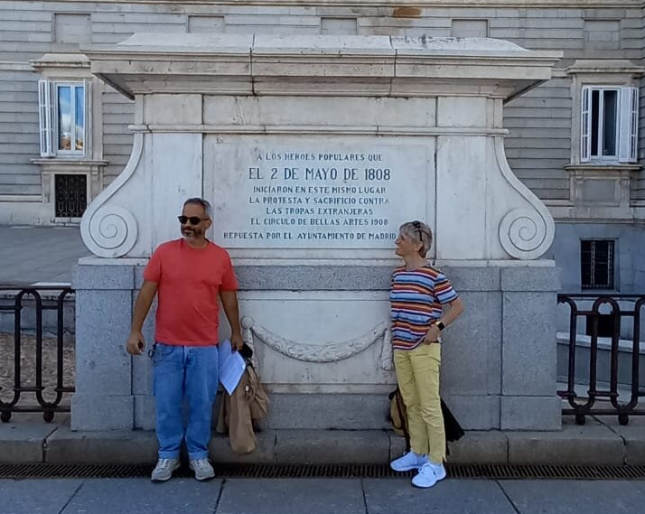
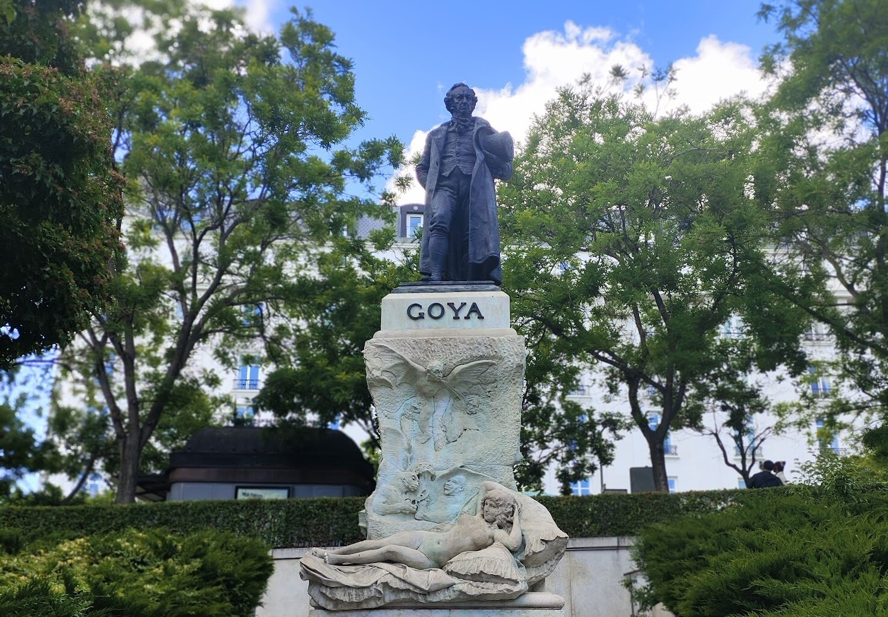
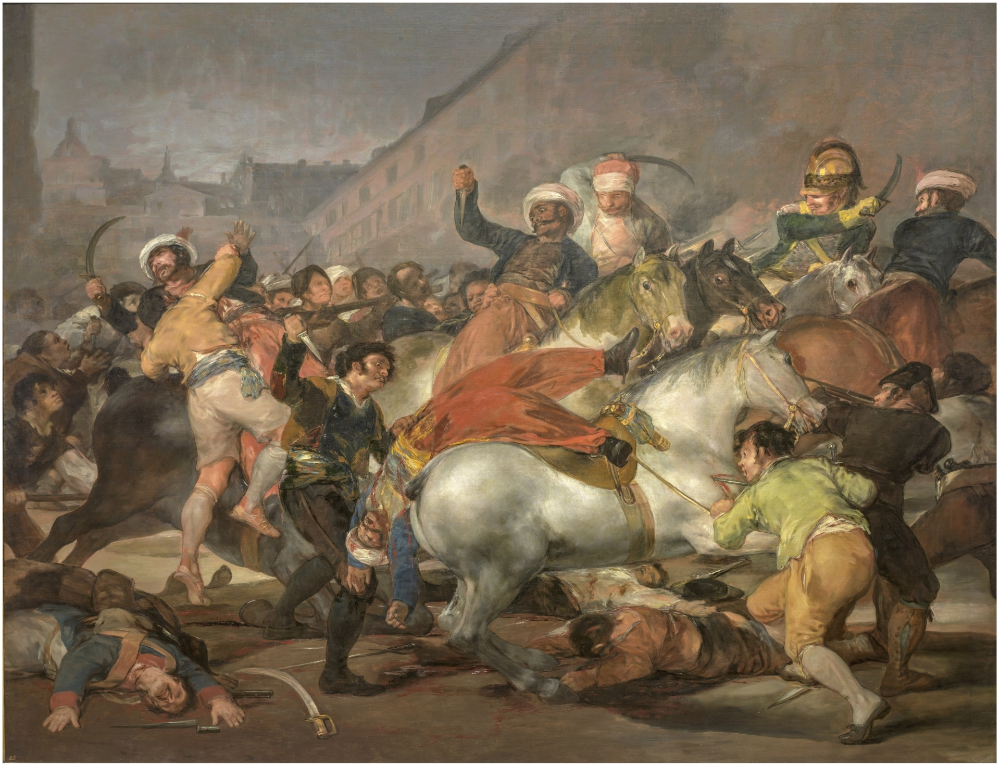
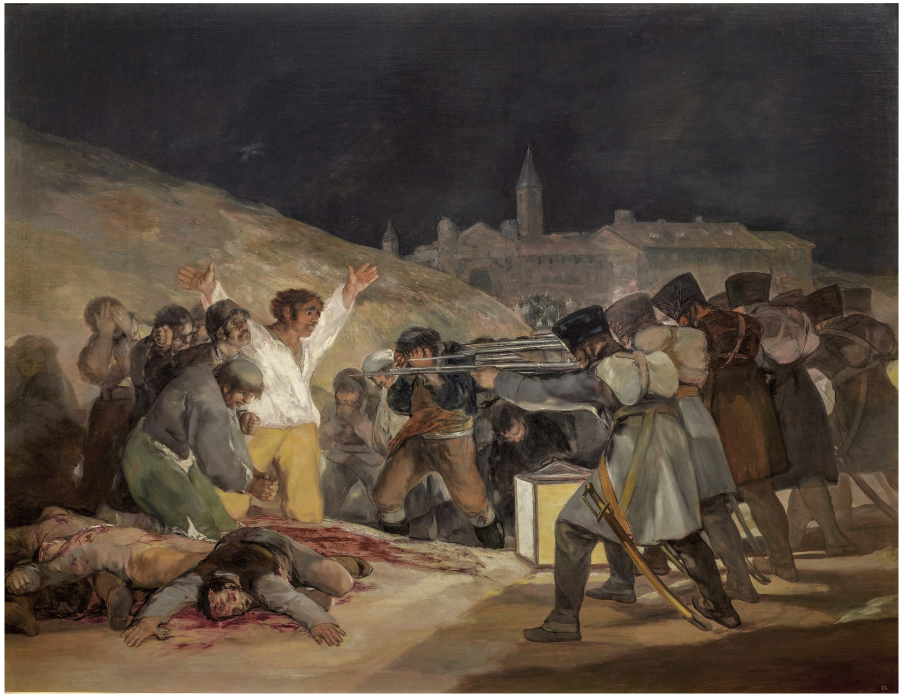
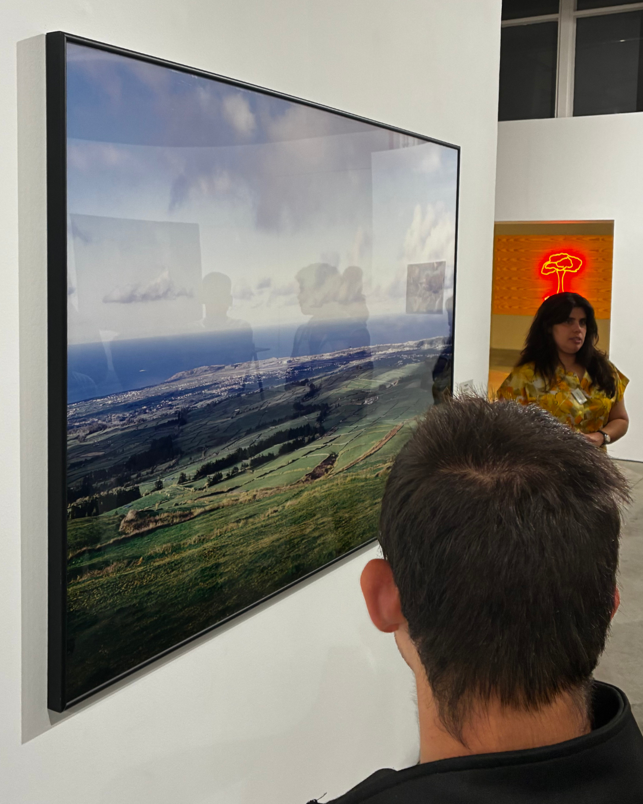
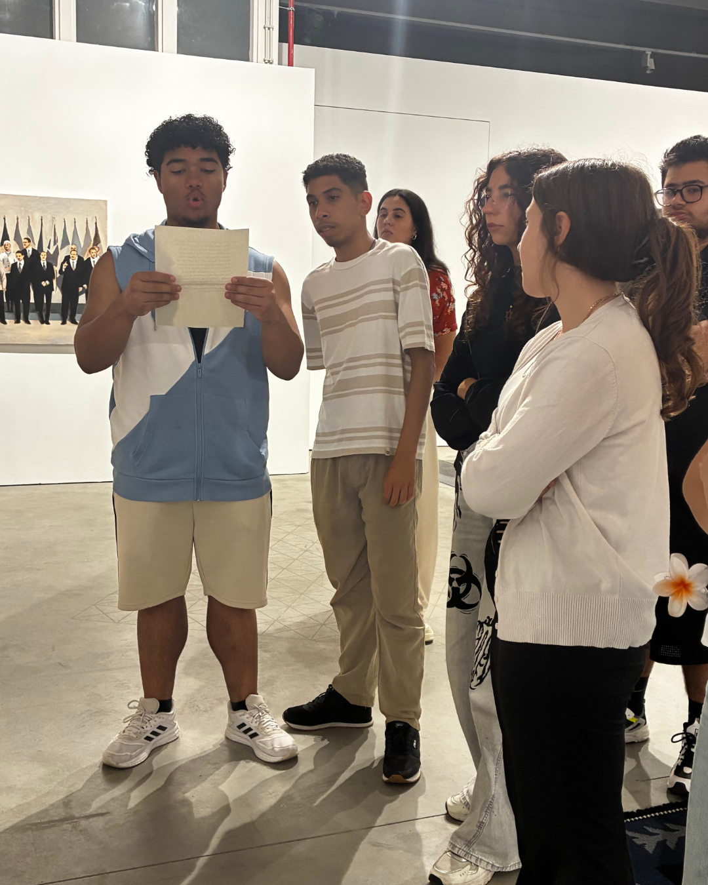
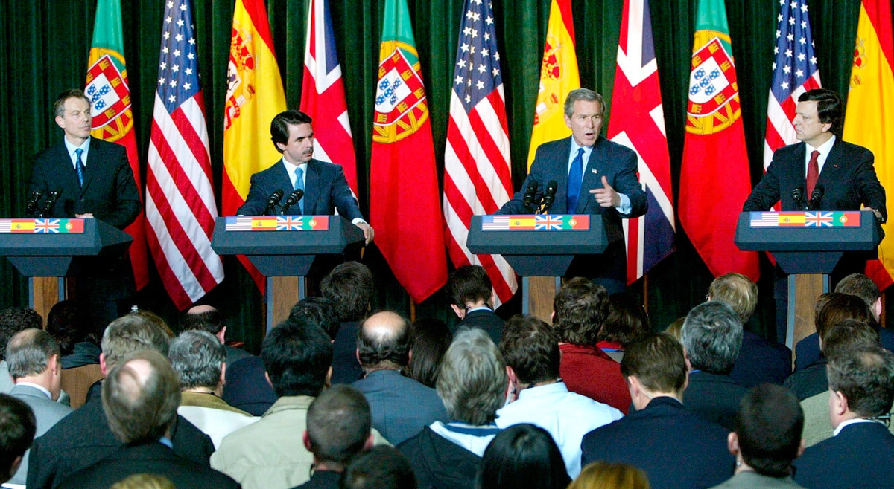
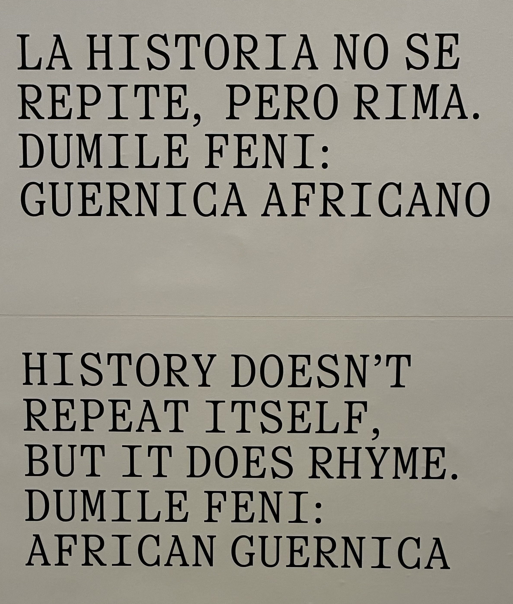
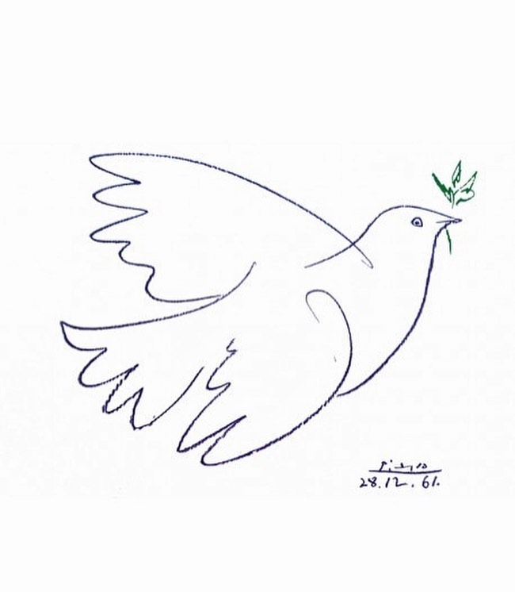
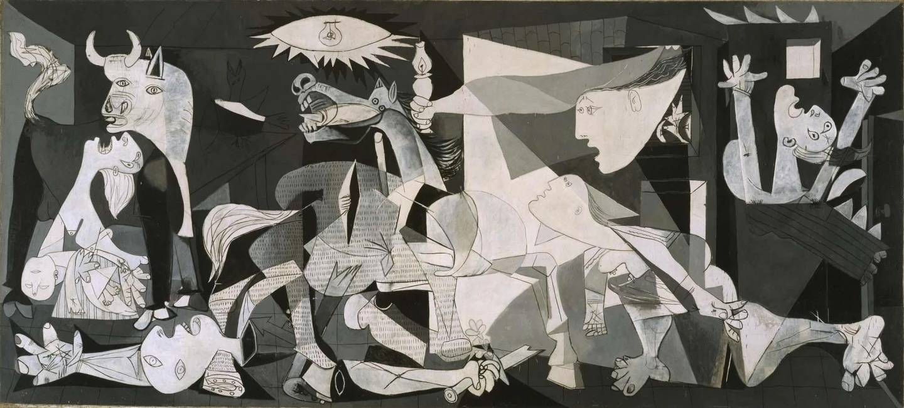

<b>Mobilidade Erasmus+ KA1</b> 
Metodologias Ativas para o Ensino e a Aprendizagem 
Madrid, maio 2026 

Filipe Gama - julho 2026

<!--
Olá. Chamo-me Filipe, sou formador no Ensino Profissional da Escola Secundária de Arrifana, nas áreas de Design, Comunicação Visual e Marketing Digital. Venho falar-vos da minha mobilidade Erasmus+, do curso de Metodologias Ativas que frequentei em Madrid e de como o estou a aplicar como estratégia de disseminação.

Meio segundo. Corte seco.
-->

---
layout: image
backgroundSize: contain
image: /goya/goya-3-maio.jpg
---

<!--
Silêncio. Dez segundos.

Isto não é um quadro histórico. É uma reportagem de guerra.

Madrid, 3 de maio de 1808. As tropas de Napoleão executam os madrilenos que se revoltaram na véspera. Goya vivia lá, viu e pintou.
Antes de existir fotojornalismo, isto era o fotojornalismo.
-->

---
layout: image
image: /goya/goya-3-maio.jpg
backgroundSize: 150%
---

<!--
Reparem no enquadramento:
- O pelotão não tem rosto, é uma máquina.
- O fuzilado tem rosto. Braços abertos, camisa branca, iluminado.
- Goya escolheu: escolheu quem vemos, quem não vemos, de que lado sentimos.
-->

---
layout: image
image: /goya/goya-3-maio.jpg
backgroundSize: 150%
---

  
Arrifana, 17 de abril de 1809

  
Só não teve pintor

<!--
Agora reparem noutra coisa.

Um ano depois, na madrugada de 17 de abril de 1809, as mesmas tropas cercaram Arrifana. A população refugiou-se na igreja, o que se revelou uma armadilha.
Os homens foram obrigados a sair e um em cada cinco foi fuzilado. Os Quintados.

CLICK

Este quadro não está só em Madrid. Também aconteceu aqui. Só não teve pintor.

Goya fez do 3 de maio memória universal. O massacre de Arrifana teve de esperar pela recriação histórica que vimos em abril.

É essa a diferença entre ter um repórter e não ter.
-->

---
layout: image
image: /goya/goya-3-maio.jpg
backgroundSize: 150%
---

  
Quem decide?

  
Quem paga?

  
Quem fica fora do <i>frame</i>?

<!--
Ler cada pergunta devagar, com pausa. A terceira fica.
-->

<!-- ============================================ -->
<!-- MOMENTO 2 — MADRID                           -->
<!-- ============================================ -->

---
layout: image
image: /goya/goya-2-maio.jpg
backgroundSize: contain
---

<!--
Cheguei a Madrid no domingo, 3 de maio de 2026. Fim de semana inteiro de feriado, que celebrava, na véspera, este quadro: a violenta revolta popular de 2 de maio contra as tropas de Napoleão.

Os quadros de Goya foram um dos elementos aglutinadores de toda a semana.

Sete dias de formação Erasmus+. 40 horas sobre metodologias ativas, aprendizagem cooperativa, CLIL, Universal Design, Inteligência artificial na educação.

No primeiro dia, Images of Spain. O coordenador contou a história de Espanha e mostrou uma península que mudou de mãos e de fés durante séculos. Camadas sobre camadas. E parou aqui, nestes quadros: o 2 e o 3 de maio, sem heróis nem vilões. Goya foi a grande referência da abertura.

-->

---
layout: center
---

  

<!--
Na tarde seguinte, num peddypaper pelas ruas do centro de Madrid, uma das perguntas levou-nos à placa do Palácio Real. O que aconteceu aqui a 2 de maio de 1808? O feriado que tínhamos acabado de viver era matéria do jogo.
-->

---
layout: center
---

  

<!--
Na quarta-feira, visitámos o Museu do Prado, como parte integrante do curso.
O ponto de encontro foi aos pés da estátua de Goya.
-->

---
layout: two-cols
layoutClass: gap-10 items-center
---

::left::

::right::

<!--
Das milhares de obras, a mediadora orientou-nos por 14 obras curadas como um argumento, não como uma visita.
Estes quadros de Goya estavam lá.

-->

---
layout: center
---

  
context4content

  
O contexto não ilustra o conteúdo.

  
O contexto é o conteúdo.

<!--
Isto teve um nome: Context4Content.
O contexto não ilustra o conteúdo. O contexto é o conteúdo.
A cidade, o museu, a rua: tudo é sala de aula quando há uma pergunta certa.

Em junho, quis testar isto com uma turma do 11.º ano, para o módulo de Neuromarketing: atenção, emoção, enquadramento — como é que as imagens nos fazem decidir?

Dias antes, fui ao Centro de Arte Oliva. Preparei a visita com o Daniel. Escolhemos o percurso, desenhámos as perguntas.
Dá trabalho, mas é a diferença entre um passeio e uma aula.
-->

---
layout: image-right
image: /oliva/sem-terra-vista.jpg
class: items-center
---

  
Alto-mar

  
À deriva

  
Vazio

  
No espaço

  
Piratas

  
Naufrágio

<!--
Uma das exposições chamava-se "Sem Terra à Vista".
À entrada, diante da parede com o título, a mediadora perguntou: o que acham que isto quer dizer?

As respostas vieram: alto-mar, à deriva, vazio, no espaço, piratas, naufrágio.
-->

---
layout: image
backgroundSize: contain
image: /oliva/3-16.jpg
---

  
3.16

  
Augusto Alves da Silva, 3.16, 2003. Coleção Norlinda e José Lima.

<!--
Lá dentro, esta fotografia do Augusto Alves da Silva.

Uma paisagem açoriana. Campos verdes, oceano azul, algumas nuvens brancas. Quase idílica.

A obra chama-se 3.16.
-->

---
layout: center
---

  
  

<!--
Enquanto tentavam decifrar a imagem, a mediadora entregou um recorte a um aluno. Ele leu em voz alta.

"Primeiros-ministros britânico, espanhol e português aguardam chegada de Bush. Tony Blair e José Maria Aznar juntam-se a Durão nas Lajes. Público, 16 de março de 2003, 16:45."
-->

---
layout: image
backgroundSize: contain
image: /oliva/3-16.jpg
---

  
3.16

  
16 de março de 2003

  
Cimeira das Lajes

  

<!--
A paisagem mudou à frente deles.

O título é uma data: 16 de março de 2003.
O dia da Cimeira das Lajes, a última encenação antes da guerra.

O fotojornalismo oficial mostrou os quatro homens alinhados com as bandeiras, num pódio. Os fazedores da paz.
-->

---
layout: image
backgroundSize: contain
image: /oliva/3-16.jpg
---

  
"O fotojornalismo não produz

  
uma imagem imparcial, nunca.

  
Porque nenhuma fotografia o é."

<!--
O jornal desse dia ainda falava em diplomacia. Dois dias depois, começou a invasão do Iraque. Alves da Silva fotografou o silêncio antes da guerra.

A mediadora lembrou-nos: o artista não é neutro.
Quem produz uma obra fá-lo a partir do seu próprio contexto, com intenções, num determinado momento, com objetivos. Nada ali estava por acaso. Nada aqui está por acaso.

O próprio Alves da Silva escreveu sobre esta série: "o fotojornalismo não produz uma imagem imparcial, nunca. Porque nenhuma fotografia o é."

-->

---
layout: image
backgroundSize: contain
image: /oliva/expo-sem-terra-2.jpg
---

<!--
A obra estava numa zona da exposição dedicada à desinformação e à desmemória. Ao que se apaga.
-->

---
layout: image
backgroundSize: contain
image: /oliva/expo-sem-terra-3.jpg
---

<!--
Goya pintou para que não se esquecesse. O Cerco da Buciqueira, em Arrifana, não teve quem o pintasse. Esta fotografia guarda o que o frame oficial deixou de fora.
-->

---
layout: image
backgroundSize: contain
image: /oliva/expo-sem-terra-1.jpg
---

<!--
Percorremos o resto: guerra, fronteiras, direitos humanos. O poder apresentado como pacífico. A paz distribuída à força.
-->

---
layout: image
backgroundSize: contain
image: /oliva/expo-sem-terra-4.jpg
---

<!--
À saída, a mediadora voltou à mesma parede.
-->

---
layout: image-left
image: /oliva/sem-terra-vista.jpg
class: items-center
---

  
Migração

  
Opressão

  
Controlo

  
Sem controlo

  
Saque

  
Piratas

<!--
Fez a mesma pergunta.
Sem terra à vista: o que quer isto dizer?
-->

---
layout: center
---

  
Piratas

<!--
Outra vez piratas, mas já não eram os mesmos piratas.

A mesma parede. A mesma pergunta. Uma hora de diferença. O contexto tinha mudado tudo.
-->

---
layout: two-cols
layoutClass: gap-10 items-center
---

::left::
<i class="text-4xl font-serif">"Não estava à espera que  a visita fosse tão política."</i>

::right::

Os alunos também   não estavam.

<!--
Pausa longa. A frase não me pertence. Mudar ligeiramente a voz.
"Não estava à espera que a visita fosse tão política."

Silêncio.
"Os alunos também não estavam."
Deixar a frase respirar.

Tal como a mediadora não estava à espera, provavelmente esta plateia também não.
Habituámo-nos a pedir à arte que nos entretenha. E ela insiste em fazer o seu trabalho.
Porque esta corrente é antiga.

Goya, Madrid, 1808.
-->

<!-- ============================================ -->
<!-- MOMENTO 4 — A RIMA                            -->
<!-- ============================================ -->

---
layout: image
backgroundSize: contain
image: /guernica/guernica.jpeg
---

  

<!--
No sábado à tarde, já depois do encerramento do curso, visitei o Reina Sofía.
Fui rever Guernica. Picasso pintou o bombardeamento de uma cidade a partir das fotografias dos jornais. Um repórter, à distância.

Na sala em frente, uma exposição com um título que era uma tese: **History Doesn't Repeat Itself, but It Does Rhyme**.
-->

---
layout: image
backgroundSize: contain
image: /guernica/african-guernica.jpg
---

<!--
Dumile Feni, artista da África do Sul, em 1967 produziu "African Guernica" — o apartheid contado com a gramática de Picasso.
-->

---
layout: image
backgroundSize: contain
image: /guernica/guernica-gaza-1.jpg
---

<!--
Já de volta a casa, descobri Mohammed Al-Hawajri, artista palestiniano. Na série Guernica-Gaza (2010-2013), sobrepôs as pinturas dos museus europeus a fotografias de Gaza.
-->

---
layout: image
backgroundSize: contain
image: /guernica/guernica-gaza-2.jpg
---

<!--
E ali estava o quadro com que começámos: o fuzilamento de Madrid a acontecer em Gaza.

Guernica. O apartheid. Arrifana. Iraque. Gaza. Rimam.
-->

---
layout: center
---

  
  

<!--
O Picasso do Guernica é o mesmo que desenhou a pomba da paz. A Europa nasceu dessas ruínas, não de tratados. Jean Monnet dizia: não unimos Estados, unimos pessoas.

Pomba (estreita/clara) e Guernica (largo/escuro) lado a lado, mesma altura,
contraste assimétrico intencional. Guernica surge ao clique.
-->

---
layout: image
image: /madrid-2026/fiat-europa.jpg
---

<!--
Foi o que encontrei em Madrid: 9 países numa sala, de professores para professores. A dimensão europeia não é um requisito do Erasmus+. É a razão de ele existir.
-->

---
layout: center
---

  
3 de maio

  
Fuzilamento em Madrid

  
Chegada a Madrid

  
Dia Mundial da Liberdade de Imprensa

<!--
Goya pintou fuzilamentos. Em Arrifana, os Quintados não tiveram pintor.

3 de maio. A data do fuzilamento em Madrid. A data em que cheguei a Madrid. E, coincidentemente ou talvez não, o Dia Mundial da Liberdade de Imprensa.
-->

---
layout: image
backgroundSize: contain
image: /guernica/wear-the-peace.jpg
---

  

<!--
Desde outubro de 2023, mais de duzentos jornalistas assassinados em Gaza por Israel. Mais do que nas duas Guerras Mundiais, no Vietname e no Afeganistão, somados.
E as imagens continuam a sair.
A história não se repete. Rima. Estava escrito na parede do museu.

-->

---
layout: center
---

<!--
- O fotojornalismo não é isento.
- A arte não é isenta.
- A pedagogia também não é.

Se o 3 de maio de 1808 merece um feriado, uma parede no Museu e a nossa memória, o que merece o que estamos a assistir agora?

Pausa.

-->

  
O fotojornalismo não é isento.

  
A arte não é isenta.

  
A pedagogia também não é.

---
layout: center
---

  
context4content

  
O contexto não ilustra o conteúdo.

  
O contexto é o conteúdo.

<!--
O contexto não serve o conteúdo. O contexto é o conteúdo.

Foi isto que fiz com os meus alunos: levei-os a um sítio onde a pergunta muda de significado. Só isso. Não precisei de Madrid. Precisei de um sítio a vinte minutos a pé da escola, de uma visita preparada e de uma pergunta certa. Qualquer disciplina o consegue fazer.

-->

---
layout: center
---

  
Quem decide?

  
Quem paga?

  
Quem fica fora do frame?

<!--
As três perguntas regressam no ecrã. Não as ler. Deixar que a sala as reconheça.
-->

---
layout: center
---

  
Write!

  
You are the intellectuals.

<!--
No último dia do curso, nas Estratégias de Disseminação, o coordenador disse-nos:

Nós, professores, fazemos coisas extraordinárias e não estamos cientes disso.

E depois, quase como uma ordem:
Write! You are the intellectuals.
Escrevam! Vocês são os intelectuais.
-->

---
layout: center
---

  
  
https://tipoexquisito.github.io/footscapes/

<!--
Foi o que fiz. Está tudo documentado aqui.

Pausa. Apontar para o ecrã. Não ler o endereço.
-->

---
layout: center

---

  
  

<!--
Uma última história.

Numa noite, em Madrid, fui beber cañas à sala Equis com uma colega de curso, Julia, uma professora alemã.
Na parede estava a ser projetado um filme-mudo: Metropolis, 1927.

-->

---
layout: image
backgroundSize: contain
image: /madrid-2026/metropolis.png
---

<!--
Metropolis, 1927.

No ecrã, uma frase:
O mediador entre a cabeça e as mãos tem de ser o coração.

Pausa muito longa.

Há dez minutos começámos com três perguntas:
- Quem decide?
- Quem paga?
- Quem fica fora do frame?

Pausa.
-->

---
layout: image
backgroundSize: 105%
image: /goya/goya-3-maio.jpg
---

<!--
No livro "Hoje, 3 de Maio", a Patrícia Portela recusa contar a história por odem. Propõe vários caminhos de leitura. Num deles, abrir na página deste quadro, escolher uma personagem, uma cor, um detalhe, e começar a viagem por aí. A leitura termina quando já não houver nada a descobrir.

Podia ter escolhido o homem de camisa branca e calças amarelas. Escolhi quem o pintou. E cheguei aqui.

Agora é a vossa vez. Escolham o vosso detalhe. Comecem a vossa viagem.

Pausa.

Eu comecei a minha viagem agora. E já não tenho terra à vista.

Silêncio. Deixar a frase cair. Só depois o ecrã muda.
-->

---
layout: center
---

  
Fiat Corde

  
Love, love is a verb, love is a doing word.

